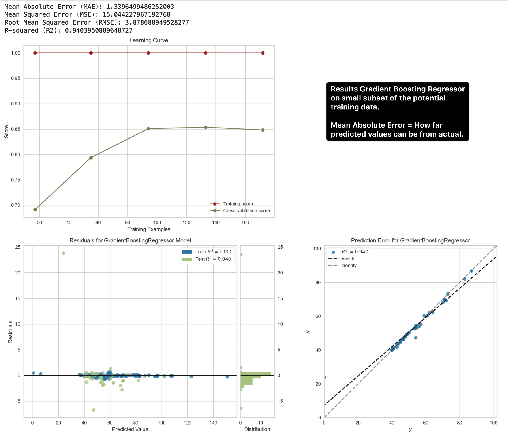

## A1Sense: Predicting HbA1c in Primary Care

**A1Sense** is a data science project focused on predicting HbA1c levels in primary care settings. HbA1c is a crucial biomarker for managing and diagnosing diabetes, providing insights into patients’ average blood glucose levels over the past 2-3 months. This project leverages advanced machine learning techniques to predict HbA1c levels, helping healthcare professionals anticipate patients’ glycemic control and enabling early intervention to improve outcomes.

### Project Overview

The objective of A1Sense is to create a robust, accurate model that can predict HbA1c levels in diabetic patients based on various clinical, demographic, and lifestyle factors commonly recorded in primary care. This model is designed to assist clinicians by providing reliable, data-driven insights, supporting proactive patient management.

### Why HbA1c Prediction?

HbA1c is widely used in diabetes management as it reflects long-term blood glucose levels. Predicting HbA1c is particularly valuable in primary care because:
- Early Intervention: By identifying patients at risk of higher HbA1c levels, primary care providers can take timely action to adjust treatment plans and improve patient outcomes.
- Resource Allocation: A predictive model allows primary care teams to prioritize patients needing more intensive intervention.
- Improving Patient Engagement: By understanding factors affecting HbA1c levels, clinicians can personalize care plans, focusing on lifestyle and clinical aspects most relevant to each patient.

### Dataset

This project utilizes de-identified primary care data, including a variety of patient features such as:
- Demographic Data: Age, gender, lifestyle factors, etc.
- Clinical Data: Blood pressure, BMI, cholesterol levels, eGFR, urine ACR, smoking status, foot risk, and more.
- Diagnosis and History: Information on diabetes diagnosis (e.g., type, duration) and other relevant conditions.

Each of these features has been carefully selected for its potential contribution to accurately predicting HbA1c levels.

## Methodology

### Data Preprocessing

Data preprocessing is a critical step in this project. It includes:
- Data Cleaning: Handling missing values, standardizing column names, and transforming relevant features.
- Feature Engineering: Creating new features like “length of diagnosis” based on diagnosis date and “age” based on date of birth to provide meaningful inputs for the model.
- Imputation: For columns with missing values, imputation strategies are used, focusing on methods like mean imputation where necessary.

### Model Selection and Evaluation

Multiple regression models were evaluated to find the best fit for HbA1c prediction:
- Gradient Boosting Regressor: The top-performing model with high predictive accuracy, low residuals, and strong explanatory power.
- Random Forest Regressor: Also performed well, though slightly less accurate than Gradient Boosting.
- Other Models: Ridge, Lasso, and Linear Regression provided moderate predictive power, while simpler models like K-Nearest Neighbors and Gaussian Process were less effective.

### Performance Metrics

To evaluate model performance, we used:
- R² Score: Measures how well the model explains the variance in HbA1c levels.
- MSE (Mean Squared Error) and RMSE (Root Mean Squared Error): Quantify the average prediction error, with lower values indicating more accurate models.
- MAE (Mean Absolute Error): Shows the average absolute difference between predicted and actual HbA1c values, helping assess prediction accuracy.

### Key Findings

- Gradient Boosting Regressor outperformed other models, achieving the highest R² score and the lowest MSE, RMSE, and MAE, making it the optimal choice for HbA1c prediction.
- Ensemble models, such as Gradient Boosting and Random Forest, generally provided better accuracy and lower residuals compared to linear models and other regressors.
- Simpler models, including K-Nearest Neighbors and Support Vector Regressor, struggled to accurately predict HbA1c levels, highlighting the need for more complex modeling approaches for this task.

## Project Goals and Future Work

### Goals

A1Sense aims to serve as a data-driven support tool for primary care providers, enabling:
1.	Enhanced Patient Care: Assisting clinicians in identifying patients at risk of poor glycemic control, leading to proactive intervention.
2.	Predictive Insights: Offering insights into which clinical and lifestyle factors significantly impact HbA1c levels, supporting personalized care strategies.
3.	Operational Efficiency: Improving resource allocation within primary care settings by helping prioritize patients who need immediate attention.

### Future Work

Future developments for A1Sense may include:
- Model Optimization: Fine-tuning hyperparameters for the Gradient Boosting Regressor and exploring deep learning approaches if more data becomes available.
- Feature Expansion: Adding more lifestyle and demographic data, such as dietary habits or physical activity, to capture additional factors influencing HbA1c.
- Integration: Potential integration with primary care electronic health record (EHR) systems, allowing real-time HbA1c prediction and decision support for healthcare providers.

### Conclusion

**A1Sense** is a powerful tool for predicting HbA1c levels in primary care, demonstrating high accuracy and reliability with Gradient Boosting techniques. By providing healthcare providers with timely, data-driven insights, A1Sense has the potential to improve diabetes management, optimize resources, and ultimately enhance patient outcomes in primary care settings. This project exemplifies the role of machine learning in supporting healthcare decision-making and improving chronic disease management.

**A1Sense** is an ongoing project, and feedback or contributions are always welcome. Let’s make primary care more proactive, predictive, and patient-centered together!
